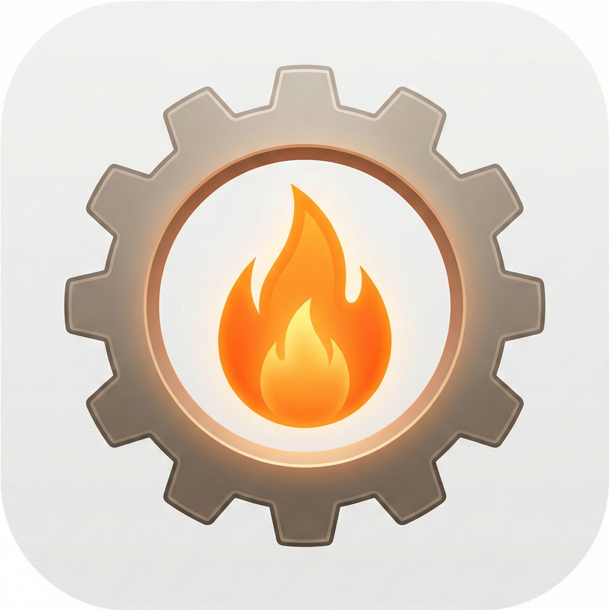
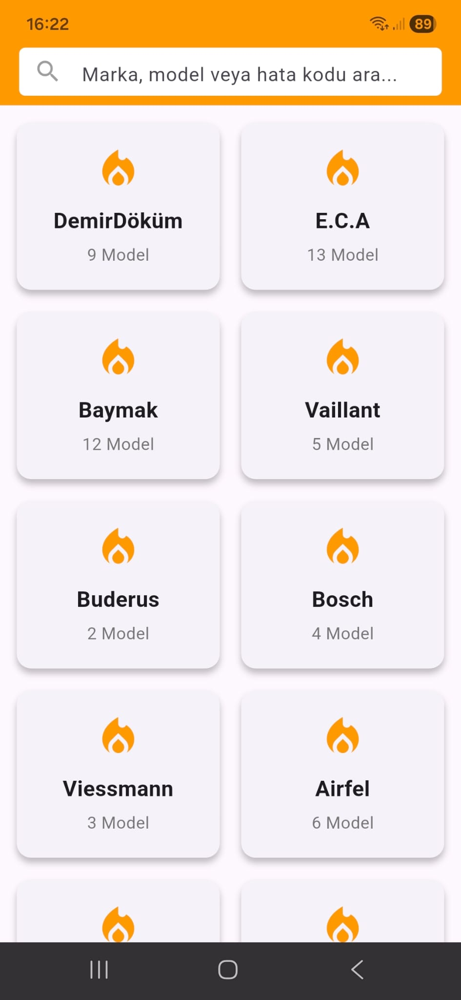
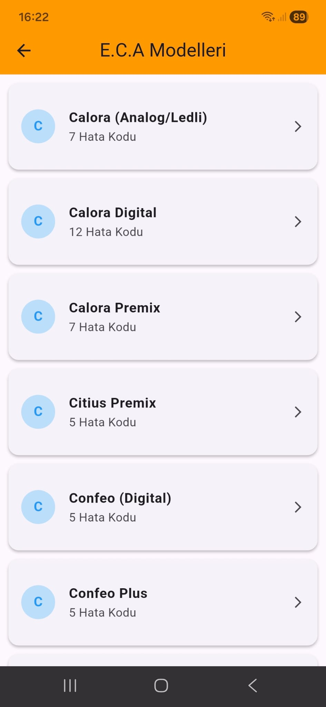
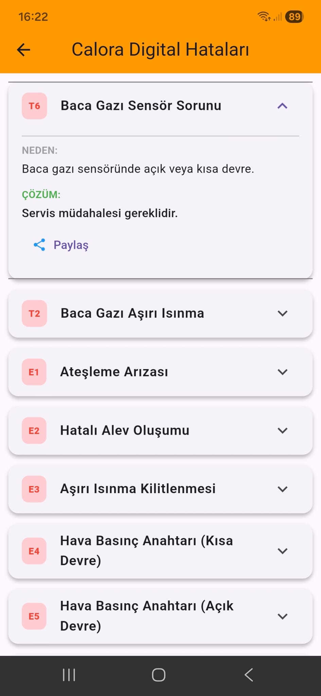
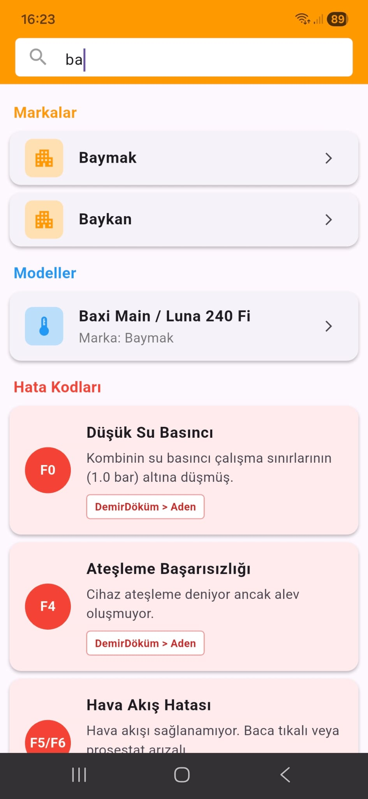
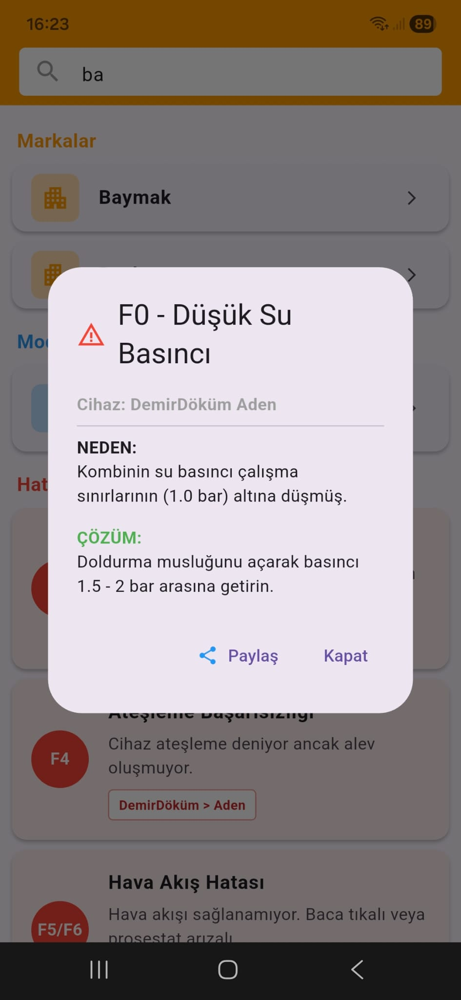

<div align="center">
  
  <h1>KombiKod</h1>
  <p><strong>The Ultimate Offline Boiler Fault Codes Assistant</strong></p>

  <p>
    
    
    
    
    
    
    
    
  </p>
</div>

---

## 📖 About KombiKod

**KombiKod** is a powerful, cross-platform mobile assistant designed for HVAC technicians, plumbers, and boiler users. It provides instant access to fault codes, error descriptions, and troubleshooting solutions for **24 major boiler brands** widely used in Turkey.

Designed for speed and reliability, **KombiKod works 100% offline**, making it the perfect tool for field technicians working in basements or areas with poor internet connectivity.

---

## 📱 App Screenshots

| Brand List | Model Selection | Fault Codes List | Advanced Search | Error Detail & Solution |
|:---:|:---:|:---:|:---:|:---:|
|  |  |  |  |  |
| *Select from 24 major brands* | *Choose the specific model* | *View all possible errors* | *Instant search by code* | *Get the solution instantly* |

---

## ✨ Key Features

* **📚 Extensive Database:** Contains detailed error codes for **24 Brands** and over **100 Models**, covering 99% of the Turkish market.
* **📴 100% Offline:** No internet connection required. All data is stored locally in optimized JSON format.
* **⚡ Instant Search:** Real-time filtering allows users to find specific error codes (e.g., "F4", "E01") instantly across all models using the **global search** feature.
* **🛠️ Practical Solutions:** Provides clear, step-by-step solutions for each error code (Resetting, Water Pressure checks, NTC Sensor checks, etc.).
* **🚀 Cross-Platform:** Built with **Flutter** to run smoothly on Android, iOS, Windows, Linux, and Web from a single codebase.
* **🎨 Clean UI:** User-friendly interface designed for quick access during field maintenance work.

---

## 🏭 Supported Brands

The application includes detailed fault codes for the following brands:

* DemirDöküm
* E.C.A
* Baymak
* Vaillant
* Buderus
* Bosch
* Viessmann
* Airfel
* Protherm
* Daikin
* Warmhaus
* Alarko
* Ferroli
* Beko
* Ariston
* İmmergas
* Baykan
* Arçelik
* TermoTeknik
* Sanica
* Auer
* Maktek
* Süsler
* Navien

---

## 🔧 Technical Details

* **Framework:** [Flutter](https://flutter.dev/) (Cross-Platform)
* **Language:** [Dart](https://dart.dev/)
* **Data Storage:** Local JSON Assets (`assets/datas.json`)
* **State Management:** Native `setState` (Optimized for performance)
* **Architecture:** MVC Pattern

---

## 📥 Installation

To run this project locally on your machine:

1.  **Clone the repository:**
    ```bash
    git clone [https://github.com/your-username/KombiKod.git](https://github.com/your-username/KombiKod.git)
    ```

2.  **Navigate to the project directory:**
    ```bash
    cd KombiKod
    ```

3.  **Install dependencies:**
    ```bash
    flutter pub get
    ```

4.  **Run the app:**
    ```bash
    flutter run
    ```

5.  **Build Release APK (Android):**
    ```bash
    flutter build apk --release
    ```

---

## 🤝 Contributing

Contributions are welcome! If you want to add a new boiler brand or correct an error code:

1.  Fork the project.
2.  Open `assets/datas.json`.
3.  Add the new brand following the existing JSON structure.
4.  Submit a Pull Request.

---

## 📄 License

This project is licensed under the MIT License - see the [LICENSE](LICENSE) file for details.

---

<p align="center">
  Made with ❤️ using <strong>Flutter</strong>
</p>
